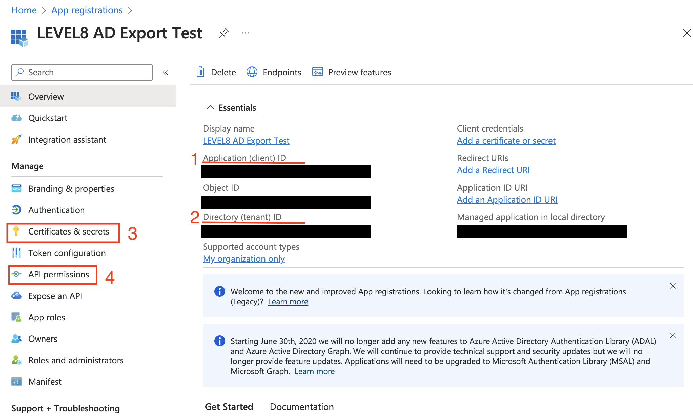
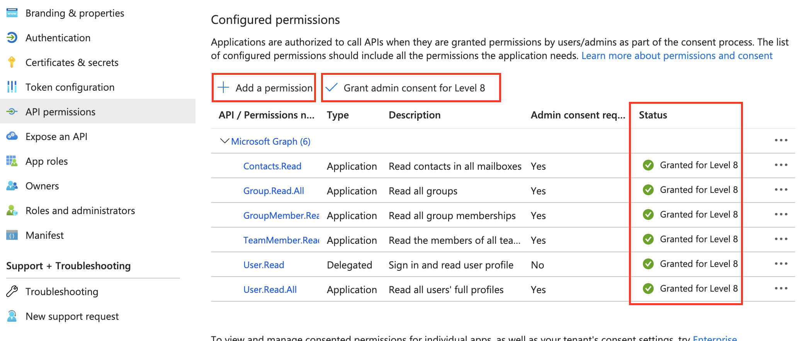

# Azure AD Group Member Export Script
The script automates the export of the Azure AD groups and sends them to a LEVEL8 employee via the
Google SMTP server. Included in the CSV export is group ID, group name, email intern,
Username and Email External

# Setup sequence
1. [Install-PS-Modules.ps1](Install-PS-Modules.ps1): Install the required PowerShell modules
2. [Save-Password.ps1](Save-Password.ps1): Securely store the password or application secret (if MFA is enabled) (more details below)
3. [Export-ADUser.ps1](Export-ADUser.ps1): Initially configure script and then run it. Explanation of the configuration values: 

    **The values that need to be initially configured by the customer (if MFA is activated):**
    ```powershell
    $CustomerName = "Name of the customer"
    $applicationId = "Application ID of the customer"
    $tenantId = "Tenant ID of the customer"
    ```

    **The values that LEVEL8 communicates to the customer:**
    ```powershell
    $EmailTo = "<Mail address of the LEVEL 8 employee>"
    $BotUser = "<Mail address of the bot>"
    $BotPassword = "<Application password of the bot user>"
    $SMTPServer = "smtp.gmail.com"
    ```


# Detailed explanation of the setup and the save password script
This PowerShell script is designed to securely store a user’s password or an application secret (if MFA is enabled for this account) in a text file.

**Important**: If MFA is enabled for the executing account, a password cannot be used to run the script automatically. Therefore, a connection with Azure PowerShell must be established via a service principal.[Link to Microsoft Documentation](https://learn.microsoft.com/en-us/powershell/azure/authenticate-noninteractive?view=azps-11.4.0)

**The steps to set up a service principal**:

1. Log in to the [Entra admin center](https://entra.microsoft.com/#home)
2. Navigate to Identity > Applications > click on App registrations
3. Click on + New registration
4. On the Register an Application page, provide a relevant Name, for example: LEVEL8 AD Export
5. Select a supported account type, which determines who can use the application. We recommend: Accounts in this organizational directory only 
6. The Redirect URI box remains empty
7. Click on Register
8. After you reach the overview page, note down the following relevant information for the configuration of the script:
   
   

   - [1] Application (client) ID
   - [2] Directory (tenant) ID
   - [3] Click on Certificates & secrets to generate a new client secret
   - [4] Click on API permissions to grant the required permissions

9. Click on Certificates & secrets
10. Choose Client secrets > + New client secrets
11. Enter a suitable description
12. Click on Add
13. Securely store the value now displayed in the table and enter it when executing [Save-Password.ps1](Save-Password.ps1)
14. Now select the API permissions tab > Then Click on + Add a permission
15. Choose from Select an API > Microsoft APIs > Mircosoft Graph > Application permissions
16. The following permissions are necessary for the execution of the script and should be selected:
    - Contacts.Read
    - Group.Read.All
    - GroupMember.Read.All
    - TeamMember.Read.All
    - User.Read
    - User.Read.All
17. Then click on the Add permissions button
18. Next to the + Add a permission, click on Grant admin consent for _Your Company Name_ 
19. The result should look like this:
    


20. Finally, fill the configuartion of the script with the now available values and execute accordingly.